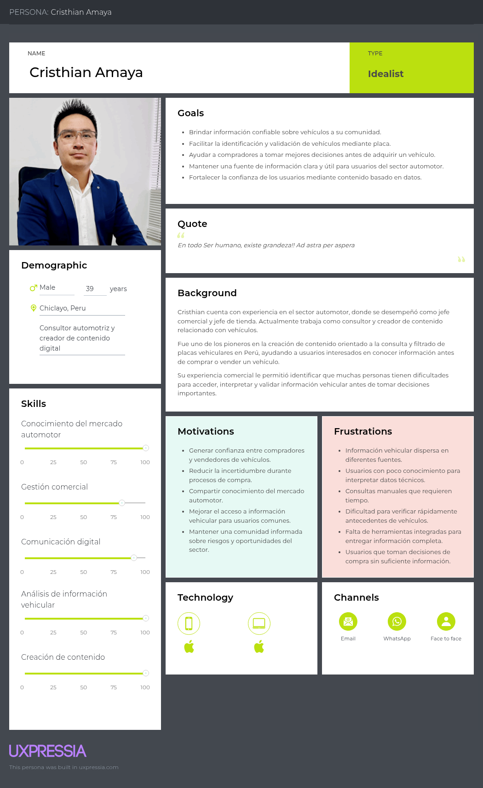
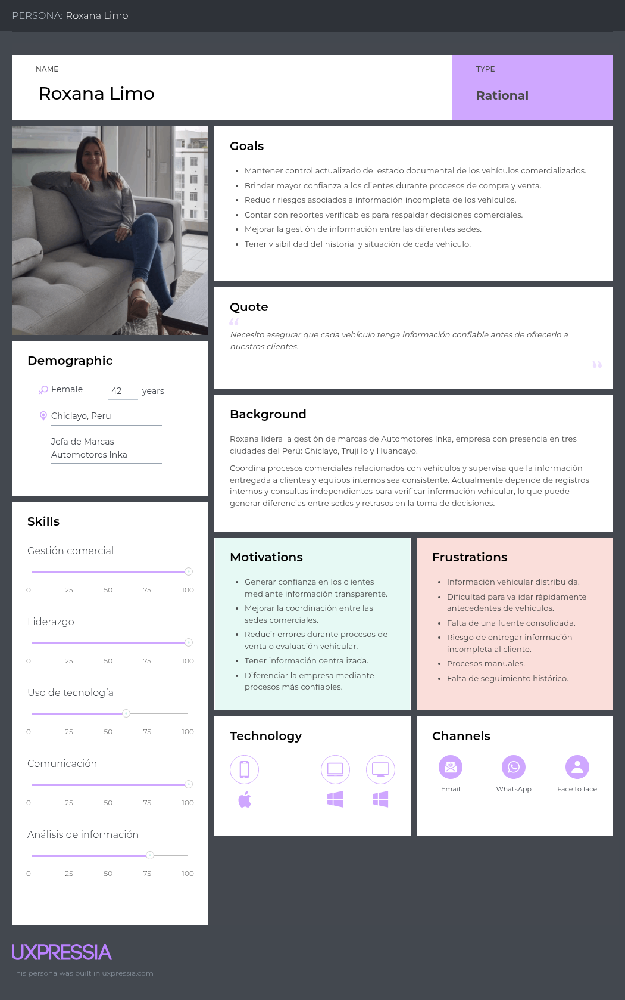
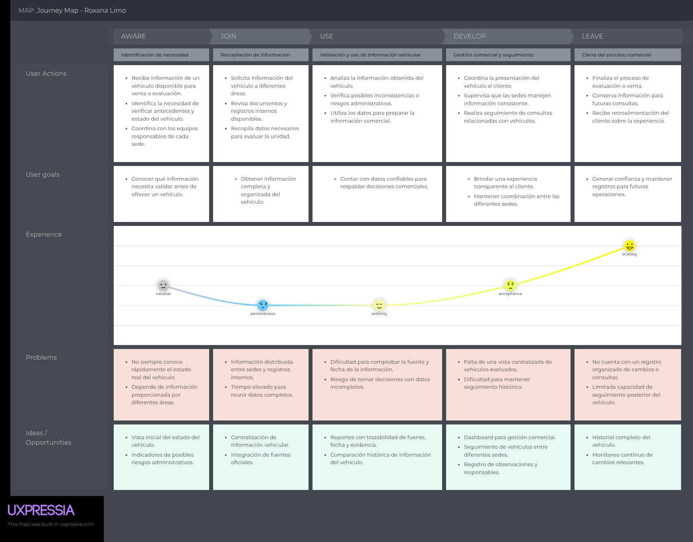
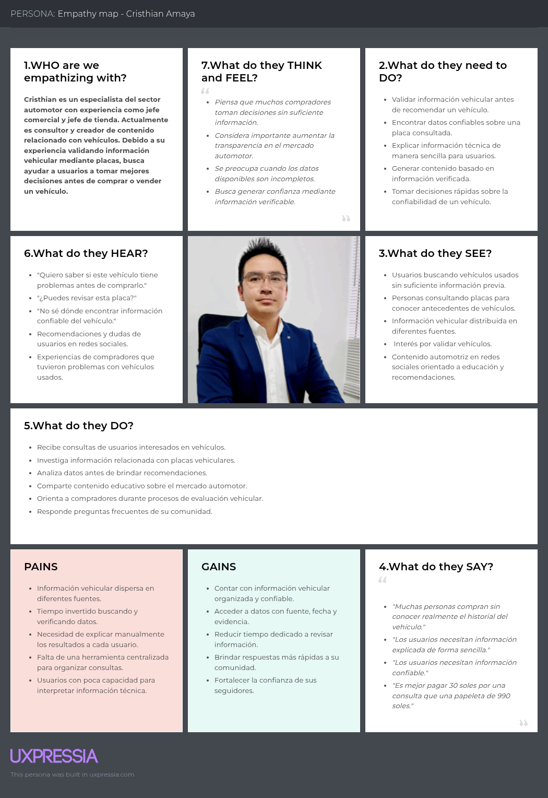
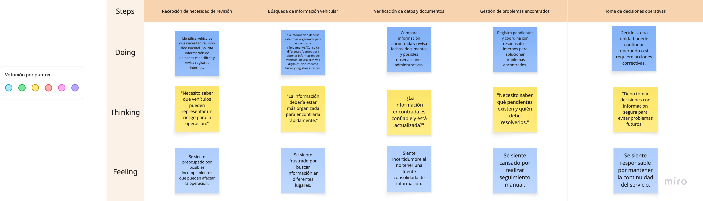
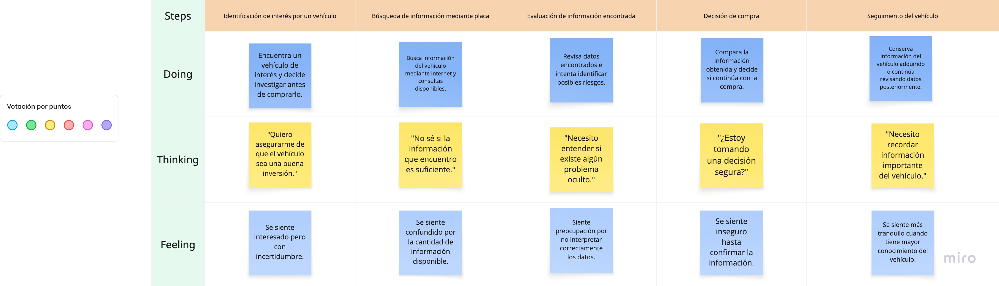
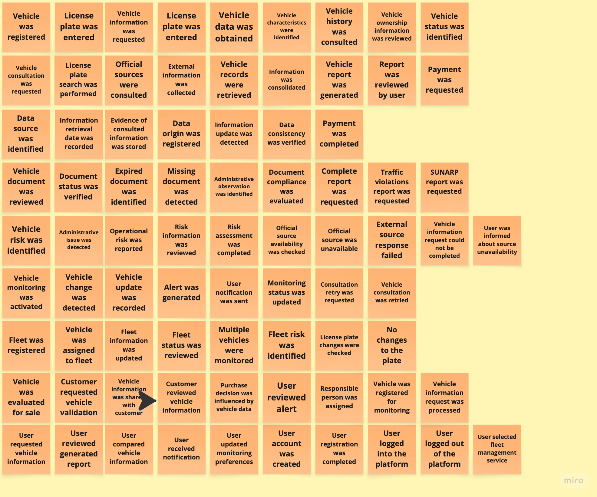
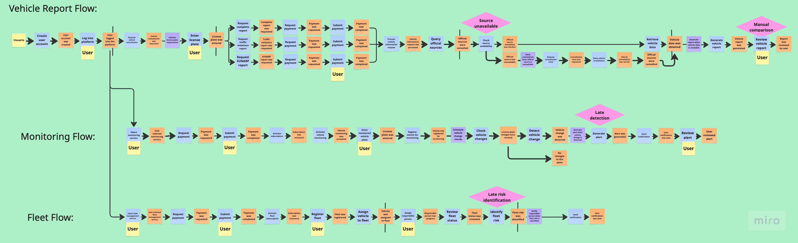
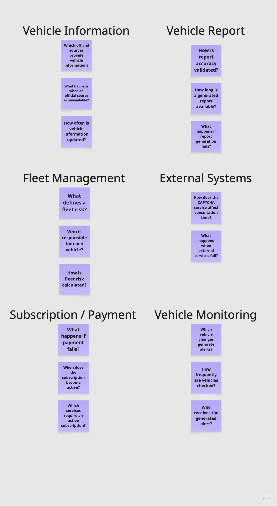

# Capítulo II: Requirements Elicitation & Analysis

## 2.1 Competidores

El análisis considera competidores directos e indirectos presentes en el mercado peruano. Autofact y Mi Torito compiten en la generación de reportes puntuales para compraventa, mientras Onway compite por el presupuesto empresarial destinado al monitoreo y control de flotas. Esta combinación permite comparar las dos propuestas que FleetProof integra: consulta documentaria trazable y seguimiento recurrente del vehículo.

### 2.1.1 Análisis competitivo

El Competitive Analysis Landscape compara la propuesta de BLIP con servicios que atienden parte del mismo problema. La información comercial fue consultada en los sitios públicos de cada empresa el 13 de septiembre de 2026. Cuando un proveedor no publica una tarifa, se consigna como cotización y no se estima un precio.

| Criterio | BLIP - FleetProof | Autofact Perú | Mi Torito | Onway by Entel Digital |
|---|---|---|---|---|
| Perfil | Plataforma web para consultar antecedentes, conservar evidencia, detectar cambios y gestionar el riesgo documentario de vehículos y flotas. | Servicio digital de informes sobre antecedentes de vehículos usados a partir de la placa. | Servicio peruano que consolida información pública vehicular y genera reportes orientados a compraventa. | Plataforma empresarial de monitoreo GPS, rutas, rendimiento y alertas para flotas. |
| Ventaja competitiva | Une reporte puntual, historial de consultas, monitoreo recurrente y trabajo colaborativo por vehículo. | Marca especializada y reporte de antecedentes entregado en pocos minutos. | Consulta de más de veinte fuentes, reporte claro y veredicto de compra asistido por inteligencia artificial. | Monitoreo en tiempo real, telemetría, analítica de combustible y soporte local. |
| Mercado objetivo | Empresas con flotas pequeñas y medianas; propietarios y compradores particulares en Perú. | Personas que compran o venden vehículos usados. | Compradores, vendedores y propietarios de vehículos en Perú. | Empresas que necesitan controlar ubicación y desempeño operativo de sus flotas. |
| Marketing | Contenido educativo, demostraciones del reporte, prueba de monitoreo y alianzas con negocios automotores. | Sitio web, blog educativo, videos y captación mediante consulta por placa. | Sitio web, aplicación móvil y comunicación centrada en el veredicto, la tasación y la negociación. | Venta B2B mediante demostraciones, cálculo de ahorro, formulario comercial y asesoría. |
| Producto | Reporte trazable, evidencia por fuente, evaluación de riesgo, flotas, responsables, historial, alertas y reportes compartibles. | Informe Full, antecedentes, multas, propietarios, gravámenes, robos y otros datos disponibles. | Reporte Avanzado e Inteligente, historial, veredicto, tasación, estrategia de negociación y PDF. | Plataforma web y móvil, GPS, rutas, alertas, historial, rendimiento y módulos de analítica. |
| Precios y costos | Modelo por validar mediante entrevistas y pruebas de disposición de pago. | Precio sujeto al flujo comercial vigente; el sitio público presenta el servicio y deriva a la solicitud del informe. | Pago único: S/ 15.90 para Reporte Avanzado y S/ 19.90 para Reporte Inteligente. | Planes Medium, Pro y Expert bajo cotización. Requiere dispositivo GPS según el plan. |
| Canales | Aplicación web responsiva, correo electrónico y reporte PDF compartible. | Plataforma web y entrega digital del informe. | Plataforma web, aplicación móvil y entrega de PDF. | Plataforma web, aplicación móvil, equipo GPS y atención comercial directa. |
| Fortalezas | Propuesta diferenciada por trazabilidad, comparación histórica y gestión colaborativa. | Experiencia especializada y amplitud del informe puntual. | Oferta local, precio visible y explicación orientada a una decisión de compra. | Capacidades maduras de rastreo, operación en tiempo real y soporte empresarial. |
| Debilidades | Producto nuevo, sin validación comercial ni integraciones oficiales demostradas todavía. | Enfoque principal en consulta puntual; no comunica gestión colaborativa de observaciones. | Orientación principal a compraventa individual; el monitoreo documentario recurrente no es el centro de la oferta. | Requiere hardware y se enfoca en ubicación y telemetría, no en consolidar antecedentes documentarios. |
| Oportunidades | Atender flotas que hoy combinan portales, hojas de cálculo y mensajería; convertir consultas aisladas en seguimiento continuo. | Extender su información hacia seguimiento recurrente y servicios para flotas. | Convertir usuarios de reportes individuales en clientes recurrentes. | Integrar riesgo documentario con su información operativa y telemétrica. |
| Amenazas | Dependencia de fuentes externas, indisponibilidad de servicios y rápida incorporación de funciones similares por empresas establecidas. | Competidores locales con precios menores y análisis más accionable. | Cambios en disponibilidad de fuentes públicas y entrada de marcas con mayor reconocimiento. | Competidores GPS de menor costo y soluciones que no requieren instalación de hardware. |

Fuentes consultadas: [Autofact Perú](https://www.autofact.com.pe/), [Mi Torito - Reporte Inteligente](https://mitorito.pe/reporte-inteligente) y [Onway by Entel Digital](https://cloud.digital.entel.pe/onway).

### 2.1.2 Estrategias y tácticas frente a competidores

BLIP seguirá una estrategia de diferenciación enfocada. FleetProof no se limitará a entregar una fotografía aislada del vehículo: conservará cada consulta como un snapshot fechado, mostrará la fuente y evidencia disponible, comparará cambios y permitirá asignar una observación a un responsable. Así, el reporte puntual funcionará como entrada a una relación recurrente con propietarios y empresas.

Las tácticas definidas son las siguientes:

- Ofrecer una consulta inicial por placa con un resumen comprensible, evidencia por fuente y fecha de obtención.
- Permitir que el usuario active el monitoreo de un vehículo después de revisar su primer reporte.
- Mostrar qué cambió entre snapshots para evitar que el usuario compare manualmente reportes completos.
- Explicar el nivel de riesgo y sus causas sin presentar la evaluación como certificación oficial.
- Incorporar flotas, responsables, alertas y casos de resolución para atender trabajo colaborativo.
- Comunicar de forma explícita la indisponibilidad de una fuente y permitir reintentos sin ocultar datos faltantes.
- Usar contenido educativo y demostraciones con casos reales para mostrar la diferencia entre consultar una vez y mantener seguimiento.
- Validar planes y precios con entrevistas y pruebas de disposición de pago antes de publicar una tarifa definitiva.

## 2.2 Entrevistas

### 2.2.1 Diseño de entrevistas

Las entrevistas serán semiestructuradas y conductuales. Cada sesión tendrá una duración máxima de cinco minutos: veinte segundos de presentación y consentimiento, cuatro minutos y veinte segundos de preguntas, y veinte segundos de cierre. Se solicitará autorización antes de grabar y se evitarán preguntas que anticipen la solución o busquen aprobación.

#### Guion para Cristhian Amaya: asesor y creador de contenido automotor

1. Cuéntame sobre la última vez que alguien te pidió revisar un vehículo antes de comprarlo o venderlo.
2. ¿Qué información buscaste y en qué fuentes la encontraste?
3. ¿Qué parte de esa revisión tomó más tiempo o generó dudas?
4. ¿Cómo decidiste si un dato era confiable y estaba actualizado?
5. ¿Cómo explicaste los hallazgos y riesgos a la persona que te consultó?
6. ¿Qué haces cuando dos fuentes muestran información distinta o una fuente no responde?
7. Después de entregar tu recomendación, ¿guardas evidencia o vuelves a revisar el vehículo? ¿Cómo?

#### Guion para Roxana Limo: responsable comercial vinculada a vehículos

1. Cuéntame sobre la última vez que tu equipo tuvo que validar un vehículo antes de ofrecerlo o tomar una decisión comercial.
2. ¿Quiénes participaron y cómo se repartieron las consultas o verificaciones?
3. ¿Qué documentos y fuentes revisaron durante ese proceso?
4. ¿Dónde registraron los resultados y cómo los compartieron entre sedes o responsables?
5. ¿Qué dato faltante o inconsistente ha retrasado una decisión recientemente?
6. ¿Cómo hacen seguimiento a una observación y saben quién debe resolverla?
7. ¿En qué situaciones vuelven a consultar un vehículo después de la primera revisión?

### 2.2.2 Registro de entrevistas

| Segmento | Entrevistado | Edad | Distrito | Fecha | Screenshot | URL Microsoft Stream | Timing | Duracion |
|---|---|---:|---|---|---|---|---|---|
| Asesoría automotriz y compradores | Cristhian Amaya | Por confirmar | Por confirmar | Pendiente | Pendiente | Pendiente | Pendiente | Máximo 5 min |
| Gestión comercial y flotas | Roxana Limo | Por confirmar | Por confirmar | Pendiente | Pendiente | Pendiente | Pendiente | Máximo 5 min |

### 2.2.3 Análisis de entrevistas

Las entrevistas todavía no han sido ejecutadas ni registradas. Por esta razón, no corresponde presentar porcentajes como hallazgos reales. Con una sola persona por perfil, además, cada resultado segmentado sería 0% o 100% y no permitiría generalización estadística. La primera entrega utilizará análisis cualitativo y frecuencias absolutas; los porcentajes se incorporarán únicamente cuando exista una muestra suficiente y evidencia trazable.

#### Hipótesis preliminares para validación

| Perfil | Hipótesis basada en artefactos actuales | Evidencia que debe buscarse en entrevista | Estado |
|---|---|---|---|
| Cristhian Amaya | La validación requiere consultar varias fuentes y explicar datos técnicos a terceros. | Relato de última consulta, fuentes usadas, tiempo invertido y forma de comunicar riesgos. | Pendiente de validación |
| Cristhian Amaya | La falta de trazabilidad reduce la confianza en una recomendación. | Forma de guardar enlaces, capturas, fechas y evidencia de cada dato. | Pendiente de validación |
| Roxana Limo | La información distribuida retrasa decisiones comerciales y coordinación. | Caso reciente, participantes, medios de comunicación y retrasos observados. | Pendiente de validación |
| Roxana Limo | Las observaciones necesitan responsable, estado y seguimiento posterior. | Método actual de asignación, control de pendientes y nueva consulta del vehículo. | Pendiente de validación |

Después de las entrevistas se codificará cada respuesta en categorías comunes: fuentes consultadas, tiempo de revisión, inconsistencias, evidencia conservada, coordinación, seguimiento y necesidad de monitoreo. Para cada hallazgo se reportará la frecuencia como `n/N` y, cuando sea metodológicamente útil, el porcentaje `n/N × 100`. También se conservarán citas breves vinculadas al timing del video, sin atribuir afirmaciones no expresadas por los participantes.

## 2.3 Needfinding

### 2.3.1 User Personas

Los User Personas fueron elaborados en UXPressia para representar a actores relevantes dentro del proceso actual de consulta, validación y uso de información vehicular. Estos perfiles permiten conectar los hallazgos del proceso de investigación con decisiones posteriores de diseño, alcance funcional y priorización de historias de usuario.

Para esta entrega se consideran dos perfiles principales de análisis:

- **Cristhian Amaya**, consultor automotor y creador de contenido digital. Representa a un actor experto que asesora a compradores y vendedores cuando necesitan interpretar información vehicular antes de tomar una decisión.
- **Roxana Limo**, jefa de marcas de Automotores Inka. Representa a una responsable comercial que necesita validar información de vehículos antes de ofrecerlos a clientes y coordinar decisiones entre diferentes sedes.

#### User Persona: Cristhian Amaya

Figura 2.1. User Persona de Cristhian Amaya.

Fuente y enlace al artefacto: UXPressia. URL: [COMPLETAR].

Cristhian evidencia la necesidad de contar con información vehicular confiable, trazable y fácil de explicar. Su trabajo depende de revisar datos antes de brindar recomendaciones, por lo que FleetProof debe permitir consultar un vehículo por placa, consolidar hallazgos relevantes y presentar un resumen comprensible para personas que no dominan términos técnicos del sector automotor.

#### User Persona: Roxana Limo

Figura 2.2. User Persona de Roxana Limo.

Fuente y enlace al artefacto: UXPressia. URL: [COMPLETAR].

Roxana evidencia una necesidad operativa vinculada a la gestión comercial de vehículos. Su principal dificultad es trabajar con información distribuida entre sedes, registros internos y consultas independientes. Para este perfil, FleetProof debe ofrecer una vista centralizada del estado del vehículo, evidencia de la fuente revisada, historial de consultas y soporte para decisiones comerciales con menor riesgo de información incompleta.

### 2.3.2 User Task Matrix

La matriz de tareas resume las actividades actuales identificadas en los perfiles de usuario. La frecuencia e importancia son preliminares y deberán validarse con entrevistas reales antes de la entrega final.

| Tarea actual | Cristhian Amaya - Frecuencia | Cristhian Amaya - Importancia | Roxana Limo - Frecuencia | Roxana Limo - Importancia | Oportunidad para FleetProof |
|---|---|---|---|---|---|
| Recibir consultas o necesidades de validación vehicular | Alta | Alta | Alta | Alta | Registrar solicitudes de revisión con motivo, placa y responsable. |
| Buscar información mediante placa o datos del vehículo | Alta | Alta | Media | Alta | Centralizar consulta vehicular desde una vista única. |
| Revisar documentos, registros internos o fuentes externas | Media | Alta | Alta | Alta | Guardar evidencia, fuente, fecha y observación por cada revisión. |
| Comparar información encontrada para detectar riesgos | Alta | Alta | Alta | Alta | Mostrar inconsistencias, alertas y nivel de riesgo explicable. |
| Comunicar resultados a terceros | Alta | Alta | Media | Alta | Generar resumen claro y reporte compartible. |
| Coordinar acciones con equipos internos | Baja | Media | Alta | Alta | Asignar pendientes, responsables y estado de resolución. |
| Conservar historial de consultas o cambios | Media | Alta | Alta | Alta | Mantener historial por vehículo y trazabilidad de decisiones. |
| Dar seguimiento posterior al vehículo | Media | Media | Media | Alta | Activar monitoreo y alertas ante cambios importantes. |
| Crear contenido o recomendaciones basadas en datos | Alta | Media | Baja | Baja | Convertir hallazgos en explicaciones comprensibles para usuarios. |

La matriz muestra que ambos perfiles comparten tareas críticas relacionadas con búsqueda, verificación, comparación y comunicación de información vehicular. La diferencia principal se encuentra en el contexto de uso: Cristhian prioriza claridad para orientar a su comunidad, mientras Roxana prioriza coordinación interna, respaldo comercial y reducción de riesgos antes de atender clientes.

### 2.3.3 User Journey Mapping

Los User Journey Maps representan la experiencia actual de cada perfil antes de utilizar FleetProof. Se organizaron en cinco etapas: identificación de necesidad, recopilación de información, análisis de datos, gestión de resultados y cierre del proceso. Cada mapa permite reconocer puntos de fricción y oportunidades que serán consideradas en los capítulos de especificación y diseño del producto.

#### User Journey Map: Cristhian Amaya

Figura 2.3. User Journey Map de Cristhian Amaya.

Fuente y enlace al artefacto: UXPressia. URL: [COMPLETAR].

El recorrido de Cristhian inicia cuando recibe consultas de usuarios interesados en conocer información de un vehículo. Luego busca datos en fuentes disponibles, interpreta hallazgos, comunica recomendaciones y mantiene relación con su comunidad. El punto más crítico aparece durante el análisis, debido a la dificultad para comprobar origen, fecha y confiabilidad de los datos. Esto justifica que FleetProof priorice trazabilidad, resumen entendible y soporte para generar evidencia antes de emitir recomendaciones.

#### User Journey Map: Roxana Limo

Figura 2.4. User Journey Map de Roxana Limo.

Fuente y enlace al artefacto: UXPressia. URL: [COMPLETAR].

El recorrido de Roxana inicia con la recepción de información de un vehículo disponible para venta o evaluación. Después coordina con distintas áreas, revisa documentos, valida posibles riesgos y utiliza los datos para preparar información comercial. El mayor dolor ocurre cuando la información se encuentra distribuida o incompleta, ya que puede retrasar decisiones y afectar la confianza del cliente. Esto sustenta funcionalidades vinculadas a historial del vehículo, registro de observaciones, seguimiento entre sedes y reportes verificables.

### 2.3.4 Empathy Mapping

Los Empathy Maps complementan los User Personas al describir lo que cada usuario ve, escucha, piensa, siente, dice y hace durante el proceso de validación vehicular. Esta herramienta ayuda a identificar preocupaciones, motivaciones, dolores y beneficios esperados desde la perspectiva del usuario.

#### Empathy Map: Cristhian Amaya

Figura 2.5. Empathy Map de Cristhian Amaya.

Fuente y enlace al artefacto: UXPressia. URL: [COMPLETAR].

Cristhian percibe que muchas personas compran vehículos usados sin información suficiente o sin capacidad para interpretar datos técnicos. Sus principales dolores son la información dispersa, el tiempo invertido en verificación y la ausencia de una herramienta centralizada para organizar consultas. Sus beneficios esperados se relacionan con reducir tiempo de revisión, brindar respuestas más rápidas y fortalecer la confianza de su comunidad mediante información verificable.

#### Empathy Map: Roxana Limo

Figura 2.6. Empathy Map de Roxana Limo.

Fuente y enlace al artefacto: UXPressia. URL: [COMPLETAR].

Roxana percibe que la confianza del cliente depende de la claridad y confiabilidad de la información entregada durante el proceso comercial. Sus principales dolores son la información distribuida entre fuentes, la dificultad para validar antecedentes con rapidez y la falta de seguimiento histórico. Sus beneficios esperados se relacionan con coordinación entre sedes, evidencia verificable, reducción de tiempos de validación y toma de decisiones comerciales con mayor seguridad.

### 2.3.5 As-is Scenario Mapping

En esta sección se registran los As-is Scenario Maps elaborados para representar la situación actual de los actores vinculados al problema de FleetProof, antes de introducir la solución propuesta por BLIP. Los mapas se construyeron con una estructura de tres niveles: acciones realizadas, pensamientos del usuario y emociones experimentadas durante el proceso. Esta lectura permite identificar puntos de dolor, necesidades de información y oportunidades para el diseño posterior de requisitos, historias de usuario y flujos de la aplicación web.

Los mapas enviados deben tratarse como evidencia visual de trabajo del equipo. Antes de la entrega final, se recomienda reemplazar o complementar las descripciones preliminares con hallazgos obtenidos en entrevistas reales, indicando fecha, herramienta utilizada, integrantes participantes y enlace al tablero original.

#### Segmento 1: responsables de flotas pequeñas y medianas

Figura 2.7. As-is Scenario Map para responsables de flotas pequeñas y medianas.

Fuente y enlace al artefacto: tablero elaborado por el equipo en Miro. URL: [COMPLETAR].

Este mapa representa el recorrido de un responsable que recibe la necesidad de revisar documentación vehicular, busca información en diversas fuentes, verifica datos y documentos, gestiona problemas encontrados y toma decisiones operativas. El principal dolor identificado es la dispersión de información y el seguimiento manual de pendientes, lo que sustenta funciones como checklist por fuente, dashboard de riesgo, registro de evidencia y casos de resolución.

#### Segmento 2: propietarios o compradores particulares

Figura 2.8. As-is Scenario Map para propietarios o compradores particulares.

Fuente y enlace al artefacto: tablero elaborado por el equipo en Miro. URL: [COMPLETAR].

Este mapa muestra el proceso de una persona que identifica interés por un vehículo, busca información mediante la placa, evalúa los datos encontrados, decide si continúa con la compra y realiza seguimiento posterior. Los puntos de dolor principales se relacionan con incertidumbre, exceso de información disponible e interpretación de datos. Esto sustenta la necesidad de un reporte claro, riesgo explicable, PDF compartible y monitoreo básico posterior.

#### Actor complementario: vendedor o equipo comercial

Figura 2.9. As-is Scenario Map para vendedor o equipo comercial.

Fuente y enlace al artefacto: tablero elaborado por el equipo en Miro. URL: [COMPLETAR].

Este mapa describe el trabajo de un vendedor o equipo comercial que recibe información del vehículo, revisa registros disponibles, valida antecedentes, prepara información comercial y atiende al cliente. Aunque este actor no necesariamente constituye un segmento independiente, ayuda a comprender el valor de la transparencia en procesos de compraventa y puede alimentar historias vinculadas a reportes compartibles y evidencia confiable.

#### Actor complementario: asesor o generador de contenido automotor

Figura 2.10. As-is Scenario Map para asesor o generador de contenido automotor.

Fuente y enlace al artefacto: tablero elaborado por el equipo en Miro. URL: [COMPLETAR].

Este mapa representa a un actor que recibe consultas de usuarios, investiga información vehicular, analiza datos, comunica resultados y mantiene confianza con su comunidad. Debe utilizarse como actor complementario, no como segmento principal, salvo que el equipo decida ampliar formalmente el alcance. Su aporte principal para FleetProof es reforzar la importancia de comunicar resultados de manera clara, verificable y útil para la toma de decisiones.

#### Síntesis de oportunidades derivadas

| Oportunidad | Sustento en los mapas | Relación con el producto |
|---|---|---|
| Centralizar información por vehículo | Los actores buscan datos en fuentes separadas y comparan documentos manualmente. | Registro de vehículo, Source Check y Evidence. |
| Explicar el riesgo encontrado | Usuarios particulares y asesores necesitan interpretar datos sin ambigüedad. | Risk Assessment con explicación textual, no solo visual. |
| Conservar trazabilidad | Flotas y vendedores requieren demostrar de dónde salió cada dato. | Fuente, fecha, evidencia y responsable por revisión. |
| Dar seguimiento a pendientes | Las flotas gestionan problemas y responsables de forma manual. | Alert y Resolution Case. |
| Compartir resultados confiables | Compradores, vendedores y asesores comunican información a terceros. | Reporte descargable y resumen compartible. |

## 2.4 Big Picture Event Storming

El equipo desarrolló el Big Picture Event Storming de FleetProof en Miro para representar los sucesos relevantes del dominio, ordenar los flujos principales e identificar riesgos y preguntas pendientes. El tablero se trabajó en tres fases: Open, Explore y Close.

### Fase Open

Durante la fase Open se realizó una exploración sin restricciones de eventos de dominio redactados en tiempo pasado. Entre los eventos identificados se encuentran el registro del vehículo y de la flota, la solicitud y generación del reporte, la consulta de fuentes oficiales, la detección de cambios, la activación del monitoreo, la identificación de riesgos, la generación de alertas y el envío de notificaciones. Esta fase permitió construir un vocabulario inicial sin ordenar todavía la solución.

Figura 2.11. Eventos de dominio identificados durante la fase Open.

### Fase Explore

En la fase Explore se ordenaron los eventos y se agruparon en tres recorridos principales: Vehicle Report Flow, Monitoring Flow y Fleet Flow. También se incorporaron actores, solicitudes, pagos, sistemas externos y puntos críticos. El flujo muestra que una consulta puede quedar incompleta cuando una fuente oficial no está disponible; que la comparación manual aumenta esfuerzo; y que un cambio o riesgo detectado tarde reduce el valor de la información.

Figura 2.12. Flujos y puntos críticos organizados durante la fase Explore.

Los principales puntos críticos identificados fueron Source unavailable, Manual comparison, Late detection y Late risk identification. Estos problemas sustentan la necesidad de registrar disponibilidad de fuentes, conservar snapshots, automatizar comparaciones, generar alertas y asignar responsables dentro de una flota.

### Fase Close

La fase Close consolidó preguntas que requieren una regla de negocio o validación posterior. Las preguntas se agruparon en Vehicle Information, Vehicle Report, Fleet Management, External Systems, Subscription / Payment y Vehicle Monitoring. Entre ellas se encuentran la frecuencia de actualización, vigencia del reporte, cálculo del riesgo, tratamiento de fallos externos, activación de la suscripción y destinatarios de una alerta.

Figura 2.13. Preguntas abiertas documentadas durante la fase Close.

Estas preguntas no deben convertirse todavía en reglas definitivas. Se utilizarán como insumo para entrevistas, Ubiquitous Language, Product Backlog y Design-Level Event Storming.

### Resultado consolidado

Figura 2.14. Vista consolidada del Big Picture Event Storming de FleetProof.

El resultado proporciona una visión compartida del dominio y delimita tres capacidades centrales: generar un reporte vehicular trazable, monitorear cambios relevantes y gestionar vehículos dentro de una flota. El tablero original se encuentra disponible en [Miro](https://miro.com/app/board/uXjVHntEsLk=/).

## 2.5 Ubiquitous Language

El Ubiquitous Language establece términos compartidos entre especialistas del dominio, diseño y desarrollo. Los nombres se mantienen en inglés para conservar consistencia con el Big Picture Event Storming y deberán utilizarse con el mismo significado en historias de usuario, interfaces, código y documentación.

| Term | Definición dentro de FleetProof |
|---|---|
| User Account | Cuenta que identifica a una persona autorizada para solicitar reportes, gestionar vehículos o recibir alertas. |
| Vehicle | Unidad identificada principalmente por su placa y asociada a información, reportes, snapshots y monitoreo. |
| License Plate | Identificador registral ingresado por el usuario para consultar o registrar un vehículo. |
| Report Request | Solicitud iniciada por un usuario para obtener un tipo específico de Vehicle Report. |
| Vehicle Report | Documento consolidado que presenta información vehicular, fuentes consultadas, fecha de obtención, hallazgos y limitaciones. |
| Complete Report | Vehicle Report que incluye todas las categorías ofrecidas por el servicio y que terminó sus consultas previstas. |
| Official Source | Servicio o registro de una entidad pública del cual se obtiene información vehicular. |
| External Source | Proveedor ajeno a FleetProof que complementa o facilita una consulta. |
| Source Check | Registro del intento de consulta a una fuente, incluyendo fecha, resultado, disponibilidad y evidencia obtenida. |
| Source Unavailability | Estado en el que una fuente no permite completar la consulta; debe mostrarse al usuario y no interpretarse como ausencia de antecedentes. |
| Evidence | Dato, respuesta o referencia conservada para sustentar un Source Check o Finding. |
| Finding | Resultado relevante que requiere explicación, atención o seguimiento; no implica por sí solo una irregularidad. |
| Snapshot | Estado consolidado de la información conocida de un Vehicle en una fecha determinada. |
| Risk Assessment | Evaluación explicable que agrupa Findings mediante reglas conocidas y produce un Risk Level. |
| Risk Level | Clasificación resumida del riesgo acompañada por las causas que la originaron. No constituye certificación oficial. |
| Fleet | Conjunto de vehículos administrados por una organización o responsable para fines de seguimiento. |
| Fleet Vehicle | Vehicle registrado dentro de una Fleet y asociado a un responsable y estado de monitoreo. |
| Responsible Person | Usuario encargado de revisar un Finding, atender una alerta o gestionar un Fleet Vehicle. |
| Monitoring Subscription | Acceso activo que habilita revisiones recurrentes para uno o más vehículos según las condiciones del plan. |
| Monitoring Cycle | Ejecución programada que genera nuevos Source Checks y compara el Snapshot reciente con el anterior. |
| Vehicle Change | Diferencia relevante detectada entre dos snapshots consecutivos del mismo vehículo. |
| Alert | Aviso generado por un Vehicle Change, Finding o fallo que cumple una regla de notificación. |
| Resolution Case | Registro de seguimiento creado para atender un Finding o Alert, con responsable, estado, evidencia y resolución. |
| Manual Comparison | Revisión realizada por una persona cuando FleetProof no puede determinar automáticamente si dos resultados son equivalentes. |
| Retry Request | Nueva solicitud de consulta para una fuente que falló o estuvo temporalmente indisponible. |
| Payment | Transacción asociada a un reporte o suscripción; solo su confirmación habilita el servicio correspondiente. |
