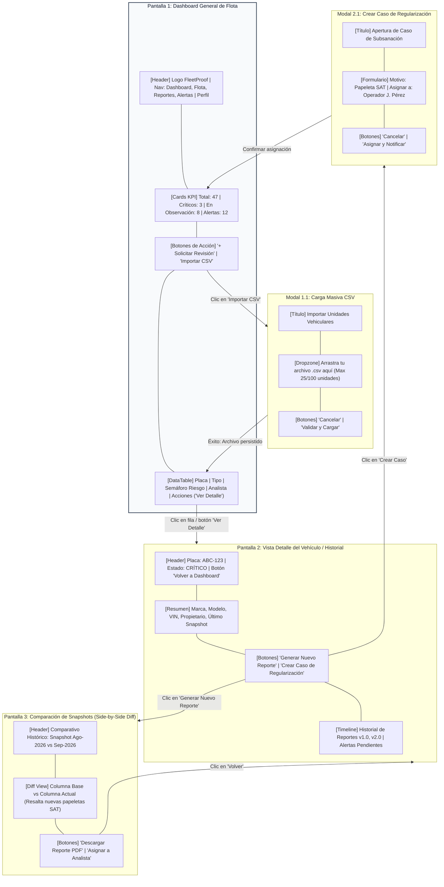
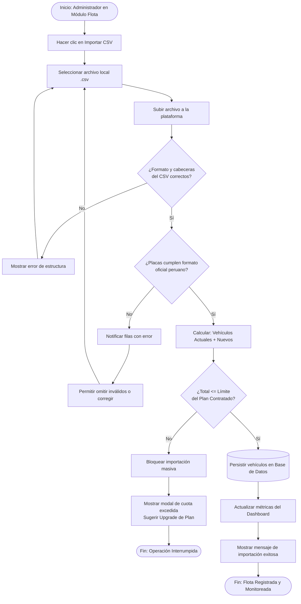
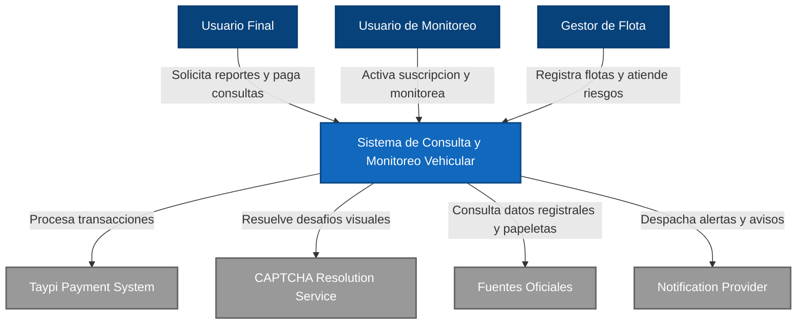
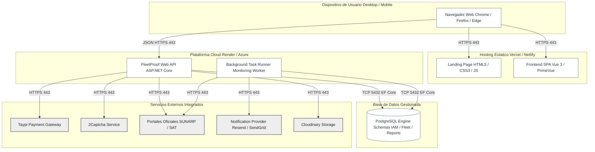

# Capítulo IV: Product Design

En este capítulo se presenta el diseño de FleetProof, una plataforma web de investigación y monitoreo vehicular que aplica UX/UI Design para ofrecer una experiencia clara, consistente y accesible a empresas gestoras de flotas y usuarios particulares. El diseño se fundamenta estructuralmente en las User Stories, el Impact Mapping y un vocabulario de dominio estandarizado, asegurando un sistema coherente que prioriza la legibilidad de los reportes, la identificación de riesgos y el seguimiento de observaciones. Estos prototipos y representaciones visuales servirán como base fundamental para validar los flujos con los representantes de ambos segmentos antes de su implementación.


## 4.1 Style Guidelines

Los lineamientos de estilo de FleetProof buscan unificar la identidad visual y la comunicación del producto en todos sus puntos de contacto, tomando como base los principios de Material Design. Para ello, se estableció un Web Style Guide como repositorio común que contiene tipografías, paleta de colores, íconos e isotipos, asegurando consistencia visual entre la Web Application y el Landing Page. Además, estos lineamientos integran criterios de accesibilidad, como la comunicación del nivel de riesgo documentario mediante la combinación obligatoria de color, texto e íconos, garantizando una experiencia inclusiva.

### 4.1.1 General Style Guidelines

La identidad visual propuesta para FleetProof busca transmitir confianza, claridad y control, cualidades fundamentales para una plataforma que permite consultar antecedentes vehiculares, comparar reportes y monitorear cambios en el estado documentario de una flota. Su estilo se basa en los principios de simplicidad, jerarquía visual y consistencia, con una apariencia profesional y comprensible para administradores de flota, analistas, propietarios y compradores particulares.

#### Branding Overview

El nombre FleetProof combina dos conceptos centrales: “Fleet”, que significa flota y representa al segmento principal del proyecto, y “Proof”, que hace referencia a prueba o evidencia. Esta combinación expresa el propósito del producto: ayudar a tomar decisiones sobre vehículos a partir de información respaldada por fuentes, fechas y evidencias.

La marca busca asociarse con una gestión organizada y transparente, en la que el usuario pueda comprender qué cambió, identificar observaciones y dar seguimiento a su resolución.

#### Logo and Isotype
El logo propuesto utiliza el nombre FleetProof con letras sans serif de apariencia moderna y trazos limpios. Como referencia tipográfica para su implementación se propone Inter SemiBold, buscando facilitar la lectura y mantener coherencia con la interfaz web.

El nombre está acompañado por un isotipo que integra la silueta de un documento con una marca de verificación. El documento representa los reportes y el registro de evidencias; la verificación simboliza el proceso de revisión de información. Su significado se vincula con la trazabilidad del servicio, sin representar una certificación oficial ni garantizar la ausencia de riesgos.

La paleta propuesta combina azul marino (#16324F) y verde petróleo (#087F8C) sobre fondo blanco. El azul marino se utiliza para expresar seriedad y estabilidad; el verde petróleo aporta una identidad tecnológica y destaca el componente de verificación. La diferenciación entre ambos colores también permite reconocer visualmente las dos partes del nombre.

La composición aplica el principio de proximidad, agrupando símbolo y nombre como una unidad; el de contraste, diferenciando sus elementos del fondo; y el de simplicidad, evitando detalles decorativos que dificulten su reconocimiento. Se propone conservar un espacio libre alrededor del conjunto equivalente, como mínimo, a la altura de la letra “F”.

El isotipo podrá utilizarse de forma independiente como favicon o identificador de la plataforma. Su construcción sencilla está pensada para facilitar la adaptación a encabezados web, reportes y pantallas pequeñas, con una revisión de legibilidad en cada tamaño de uso.

 

#### Colores

La paleta cromática propuesta para FleetProof busca transmitir confianza, claridad y profesionalismo, valores relacionados con su propósito de organizar reportes vehiculares y facilitar el monitoreo documentario de flotas.

El azul marino (#16324F) constituye el color principal de la identidad y busca comunicar seriedad y estabilidad. Se utiliza en el logotipo y los encabezados para establecer una jerarquía visual clara. El verde petróleo (#087F8C) aporta un carácter tecnológico y permite destacar botones y elementos interactivos. Ambos se equilibran con el blanco (#FFFFFF), empleado como fondo principal para dar espacio al contenido y favorecer una presentación limpia.

Como colores secundarios, se incorporan el gris oscuro (#334155) para textos principales, el gris medio (#64748B) para información complementaria y el gris claro (#F1F5F9) para diferenciar tarjetas y superficies. Esta distribución aplica los principios de contraste y jerarquía, ayudando a distinguir información relevante sin sobrecargar la interfaz.

También se incluyen colores destinados a comunicar estados: verde (#2E7D32) para acciones completadas correctamente, ámbar (#F9A825) para advertencias y rojo (#D32F2F) para errores u observaciones críticas. Estos indicadores deben acompañarse de textos e iconos para que su significado no dependa únicamente del color.

El uso consistente de esta paleta en la plataforma, el sitio de presentación y los reportes busca reforzar el reconocimiento de FleetProof y facilitar una experiencia visual ordenada y comprensible.


#### Tipografía

La tipografía propuesta para FleetProof busca equilibrar modernidad, claridad y profesionalismo, en coherencia con una plataforma dedicada a la consulta de reportes vehiculares y al monitoreo documentario de flotas. Para ello, se selecciona Inter, una familia sans serif de trazos limpios que permite construir una identidad visual uniforme mediante distintos tamaños y grosores.

En títulos y encabezados se utiliza Inter SemiBold (600), con tamaños de 48, 36, 24 y 20 px, según su nivel de importancia. Esta diferenciación aplica el principio de jerarquía visual, orientando la atención desde los títulos principales hacia las secciones y tarjetas de información. Los tamaños mayores se adaptarán en pantallas pequeñas para evitar cortes y conservar una composición equilibrada.

Para textos de cuerpo y descripciones se propone Inter Regular (400) de 16 px, acompañado de un interlineado de aproximadamente 1,5 veces el tamaño de la letra. Los textos complementarios utilizan 14 px, mientras que las notas auxiliares pueden emplear 12 px, reservando este último tamaño para información no esencial. Estas decisiones buscan facilitar la lectura de reportes y evitar una presentación demasiado compacta.

Los botones y las etiquetas emplean Inter Medium (500) de 14 px, proporcionando énfasis suficiente para reconocer acciones como “Consultar reporte” sin competir visualmente con los encabezados.
El uso de una sola familia tipográfica refuerza los principios de consistencia y simplicidad. La variación controlada de tamaño, peso y espaciado permite organizar la información y mantener una experiencia visual coherente entre la plataforma, el sitio de presentación y los reportes de FleetProof.


### 4.1.2 Web Style Guidelines

En esta sección se definen los estándares visuales y de interacción para las interfaces web de FleetProof, tomando como referencia el diseño de su landing page. Estos lineamientos buscan mantener una experiencia coherente, comprensible y adaptable a distintos dispositivos, facilitando la consulta de servicios, la comparación de planes y el contacto con la empresa.

La propuesta conserva el azul marino (#16324F), el verde petróleo (#087F8C), los fondos blancos y los tonos grises del diseño. Asimismo, utiliza la familia tipográfica Plus Jakarta Sans y componentes con bordes redondeados. Las reglas responsive y los estados de interacción descritos complementan el mockup de escritorio y deberán aplicarse durante el desarrollo.

#### Responsive Design: 
Se propone organizar la interfaz en tres rangos: móviles, con anchos inferiores a 768 px; tabletas, entre 768 y 1023 px; y escritorio, desde 1024 px. El contenido utilizará un contenedor centrado con un ancho máximo de 1280 px y márgenes interiores de 16 px en móviles y 24 px en pantallas mayores. Las secciones con texto e imagen se apilarán verticalmente en móviles. Las cuatro tarjetas de precios se distribuirán en una, dos o cuatro columnas según el espacio disponible. Se utilizarán distribuciones flexibles y alturas ajustables al contenido para evitar recortes y desplazamiento horizontal de la página.

#### Typography and Spacing: 
Se empleará Plus Jakarta Sans para títulos, párrafos y elementos interactivos. El encabezado principal conservará los 48 px y el peso 800 del diseño de escritorio, reduciéndose aproximadamente a 32 px en móviles. Los párrafos utilizarán tamaños de 16 a 18 px y un interlineado cercano a 1,5. Los tamaños de 12 px se reservarán para notas auxiliares. Se propone una escala de espaciado basada en 4, 8, 12, 16, 24 y 32 px, que permitirá agrupar elementos relacionados y separar visualmente las secciones.

#### Navigation: 
La barra superior mantendrá el logotipo, los enlaces Inicio, Servicios, Nosotros, Precios y Contacto, y la acción para agendar una demostración. La sección activa se identificará mediante texto destacado y una línea inferior verde petróleo, siguiendo el diseño proporcionado. Cuando el contenido no quepa horizontalmente, los enlaces se agruparán en un menú desplegable accesible mediante teclado. El pie de página conservará los enlaces de navegación y la información de contacto sobre fondo azul marino.


#### Buttons: 
Las acciones principales, como solicitar una demostración o enviar el formulario, utilizarán fondo verde petróleo (#087F8C), texto blanco y bordes redondeados de 12 px. Las acciones secundarias tendrán fondo blanco, texto azul marino y un borde definido. Se propone una altura mínima de 44 px y un espaciado interior suficiente para facilitar su selección. Las etiquetas expresarán acciones concretas, como “Consultar reporte” o “Solicitar cotización”. Los enlaces se utilizarán para navegar y los botones para ejecutar acciones.

#### Interaction States: 
Los controles tendrán estados normal, hover, foco, presionado y deshabilitado. Al pasar el cursor, se aplicará un cambio moderado de fondo o borde; al navegar con teclado, aparecerá un contorno de foco claramente visible. Los controles deshabilitados mostrarán una apariencia diferenciada y una explicación cuando la causa no sea evidente. Durante el envío de información, el botón mostrará un indicador y el texto “Enviando…”, evitando solicitudes duplicadas. Estos cambios conservarán las dimensiones del componente para impedir movimientos inesperados.

#### Cards: 
Las tarjetas agruparán servicios, beneficios y planes mediante un título, una descripción breve y, cuando corresponda, una acción. Se mantendrán fondos blancos o gris claro (#F1F5F9), bordes suaves y esquinas redondeadas de 12 a 16 px, presentes en el diseño. Las tarjetas de precios conservarán un orden común para nombre, importe, periodicidad, características y botón. Cualquier plan destacado incluirá una etiqueta explicativa además del cambio de color. Esta estructura facilita la comparación y aplica los principios de proximidad y consistencia.


#### Forms: 
El formulario de contacto incluirá nombre, empresa, segmento de usuario, cantidad de unidades, correo electrónico y mensaje, tomando como referencia la landing page. Cada campo contará con una etiqueta visible, indicación de obligatoriedad y ejemplos cuando sean necesarios. Se propone adaptar los requisitos al segmento: para particulares, el campo empresa será opcional y se aceptará un correo personal. Los errores aparecerán junto al campo correspondiente con instrucciones específicas, como “Ingresa un correo electrónico válido”. Si el envío falla, se conservarán los datos ingresados y se ofrecerá la posibilidad de reintentar.

#### Tables: 
Para las vistas de vehículos y reportes de la aplicación se propone extender el mismo estilo visual mediante tablas con encabezados claros, separadores discretos y filas suficientemente espaciadas. Estas podrán mostrar placa, fecha de revisión, estado documentario y acciones disponibles. Los listados extensos incorporarán búsqueda, filtros y paginación. En móviles se priorizarán los datos esenciales o se permitirá desplazamiento horizontal dentro de la tabla. También se definirán mensajes para carga, ausencia de registros y errores, evitando que un espacio vacío genere incertidumbre.

#### Alerts and Status Indicators: 
Las confirmaciones utilizarán verde (#2E7D32), las advertencias ámbar (#F9A825) y los errores rojo (#D32F2F). Los mensajes informativos podrán utilizar azul marino sobre un fondo claro. Cada aviso incluirá un icono, una descripción y, cuando corresponda, una acción, como “Reintentar” o “Revisar observación”. El ámbar se combinará con texto oscuro para favorecer su lectura. Los estados documentarios deberán indicar su significado y la fecha de revisión; la falta de información se mostrará como “Sin verificar”, evitando confundirla con un resultado favorable.

#### Accessibility: 
La interfaz deberá permitir la navegación completa mediante teclado, mantener un orden de foco lógico y proporcionar etiquetas accesibles para campos y botones con iconos. Las imágenes informativas tendrán textos alternativos y los elementos decorativos no interferirán con los lectores de pantalla. Se verificará un contraste mínimo de 4,5:1 para texto normal y de 3:1 para texto grande, conforme al criterio de contraste de WCAG. Los errores y estados se comunicarán con texto e iconos, además del color. También se comprobará que el contenido pueda ampliarse sin perder información y se respetará la preferencia de movimiento reducido del usuario.

## 4.2 Information Architecture

La arquitectura de información de FleetProof busca facilitar el acceso a los servicios de consulta vehicular, reportes trazables y monitoreo documentario. Su estructura organiza los contenidos de acuerdo con las necesidades de empresas con flotas y de propietarios o compradores particulares, permitiendo avanzar desde una visión general hasta los detalles de cada vehículo, sus observaciones y evidencias.

En la landing page, la información se distribuye en las secciones Inicio, Servicios, Nosotros, Precios y Contacto. Esta estructura permite conocer la propuesta de valor, explorar los servicios, identificar una alternativa adecuada y solicitar atención. En la aplicación web, se propone organizar las funcionalidades alrededor de vehículos, reportes, alertas y seguimiento de observaciones.

Estas decisiones buscan reducir la sobrecarga de información, facilitar la navegación y mantener una relación clara entre cada vehículo, sus antecedentes y las acciones pendientes.

### 4.2.1 Organization Systems

FleetProof combinará diferentes sistemas de organización para que los usuarios puedan localizar información, comparar alternativas y completar sus tareas de manera ordenada.

#### Jerárquica:
La información se estructurará desde categorías generales hacia contenidos específicos. En la aplicación, el usuario podrá ingresar a Flota, seleccionar un vehículo, consultar sus reportes y revisar los hallazgos con sus respectivas fuentes y evidencias. El dashboard presentará un resumen de vehículos monitoreados y observaciones pendientes, desde el cual se accederá al detalle. Esta organización permitirá comprender dónde se encuentra cada contenido y profundizar sin mostrar toda la información simultáneamente.

#### Secuencial (Step-by-step):
Se aplicará en procesos que requieren un orden definido. Para solicitar un reporte, el usuario seleccionará o registrará un vehículo, confirmará los datos, enviará la solicitud y consultará el resultado cuando esté disponible. Para atender una observación, el flujo comprenderá revisar el hallazgo, asignar un responsable, registrar las acciones realizadas y adjuntar evidencia de resolución. Cada proceso mostrará su estado y permitirá corregir información antes de confirmar, reduciendo errores y solicitudes incompletas.

#### Por audiencia:
La información se adaptará a los dos segmentos principales del proyecto. Las empresas accederán a una visión consolidada de sus flotas, con opciones para organizar vehículos, revisar riesgos y coordinar la atención de observaciones. Los propietarios y compradores particulares tendrán una experiencia centrada en consultar uno o pocos vehículos, comprender sus antecedentes y recibir alertas. En la landing page, las descripciones de servicios y planes ayudarán a cada segmento a identificar la alternativa que corresponde a sus necesidades.

#### Por roles y responsabilidades:
Dentro de la plataforma, las opciones se organizarán según las tareas y permisos de cada usuario. El administrador de flota podrá gestionar vehículos y coordinar responsables; el analista documentario organizará consultas, resultados y evidencias; y el supervisor revisará los reportes antes de su publicación. Esta diferenciación complementará la organización por audiencia, mostrando a cada usuario las herramientas necesarias para su trabajo.

#### Por tópicos:
La landing page agrupará el contenido en Inicio, Servicios, Nosotros, Precios y Contacto, conservando su navegación actual. En la aplicación se proponen módulos como Flota o Mis vehículos, Reportes, Alertas, Casos de resolución y Suscripción. Cada módulo reunirá información relacionada con una necesidad concreta, facilitando el acceso directo sin recorrer secciones ajenas a la tarea.

#### Cronológica:
Los reportes, las alertas y las actividades de seguimiento se organizarán por fecha, mostrando primero los registros más recientes. Cada reporte conservará su fecha de elaboración y las fechas de consulta de sus fuentes. Esta organización facilitará reconocer cambios, comparar versiones y reconstruir el seguimiento de una observación.

Como apoyo visual, la sección Precios utilizará una cuadrícula de tarjetas con una estructura común para comparar servicios, beneficios y condiciones. Los vehículos y reportes podrán presentarse en tablas con filtros. Estas formas de presentación complementarán los sistemas de organización y facilitarán la exploración de conjuntos de información.


### 4.2.2 Labeling Systems

El sistema de etiquetado de FleetProof busca comunicar de forma breve y clara el propósito de cada sección y acción. Se utilizarán términos relacionados con vehículos, reportes y monitoreo documentario, evitando expresiones técnicas que dificulten la comprensión. Las etiquetas conservarán el mismo significado en toda la plataforma para facilitar su reconocimiento.

En los menús se emplearán nombres breves, como “Reportes” o “Alertas”; en los botones, verbos que indiquen una acción concreta, como “Consultar vehículo” o “Descargar reporte”.

#### Landing Page

Las etiquetas de navegación mantendrán la estructura del diseño de FleetProof:

| Etiqueta  | Contenido o función                                                                    |
| --------- | -------------------------------------------------------------------------------------- |
| Inicio    | Presentación de FleetProof, su propuesta de valor y acceso a las acciones principales. |
| Servicios | Explicación de las consultas, reportes y opciones de monitoreo vehicular.              |
| Nosotros  | Información sobre el equipo y el propósito del proyecto.                               |
| Precios   | Comparación de servicios, planes, beneficios y condiciones.                            |
| Contacto  | Información de atención y formulario para solicitar una demostración o cotización.     |

Para las llamadas a la acción se proponen etiquetas como “Consultar vehículo”, “Monitorear flota”, “Agendar demo” y “Solicitar cotización”. Estas expresiones permiten anticipar el propósito de cada interacción.

#### Web Application: empresas con flotas

Las etiquetas propuestas para este segmento priorizan la gestión conjunta de vehículos y el seguimiento de observaciones.

| Etiqueta         | Contenido o función                                                                    |
| ---------------- | -------------------------------------------------------------------------------------- |
| Panel de control | Resumen de vehículos monitoreados, alertas y observaciones pendientes.                 |
| Flota            | Registro, importación y consulta de vehículos de la organización.                      |
| Reportes         | Acceso a reportes individuales y consolidados, con opciones de comparación y descarga. |
| Alertas          | Notificaciones sobre cambios y situaciones que requieren atención.                     |
| Casos            | Seguimiento de observaciones, responsables, acciones y evidencias de resolución.       |
| Equipo           | Administración de miembros, roles y permisos, según el acceso autorizado.              |
| Suscripción      | Consulta del plan contratado, límites y consumo disponible.                            |
| Configuración    | Preferencias de la cuenta y de la organización.                                        |

#### Web Application: propietarios y compradores particulares

Las etiquetas de este segmento se enfocarán en la consulta y el seguimiento de uno o pocos vehículos.

| Etiqueta          | Contenido o función                                                      |
| ----------------- | ------------------------------------------------------------------------ |
| Mi panel          | Resumen de los vehículos registrados y las alertas recientes.            |
| Mis vehículos     | Registro de placas y acceso al detalle de cada vehículo.                 |
| Solicitar reporte | Inicio de una consulta sobre el vehículo seleccionado.                   |
| Mis reportes      | Historial de reportes, resultados y archivos disponibles para descargar. |
| Alertas           | Avisos relacionados con los vehículos monitoreados.                      |
| Suscripción       | Información del plan, consultas utilizadas y capacidad disponible.       |
| Mi perfil         | Actualización de datos personales y preferencias de la cuenta.           |

#### Etiquetas de acciones y estados

Los botones utilizarán expresiones consistentes como “Agregar vehículo”, “Importar vehículos”, “Ver reporte”, “Comparar reportes”, “Descargar PDF”, “Asignar responsable” y “Adjuntar evidencia”.

Los estados se expresarán mediante etiquetas específicas: “En elaboración”, “En revisión” y “Publicado” para reportes; y “Pendiente”, “En atención” y “Resuelto” para casos. Cuando una fuente aún no haya sido consultada, se mostrará “Sin verificar”, evitando que la ausencia de información se interprete como un resultado favorable.

Cada estado estará acompañado de una explicación cuando sea necesaria y no dependerá únicamente del color. Asimismo, las opciones visibles se ajustarán a los permisos de cada usuario, manteniendo los mismos nombres para las funciones compartidas.


### 4.2.3 SEO Tags and Meta Tags

#### 4.2.3. SEO Tags and Meta Tags

Para describir adecuadamente el contenido de FleetProof y facilitar su identificación en navegadores y buscadores, se proponen etiquetas SEO y metadatos para la landing page y la aplicación web. Los valores comunicarán el propósito de cada página mediante textos claros y relacionados con los reportes vehiculares y el monitoreo documentario.

Cada etiqueta cumplirá una función específica:

* **Title:** identificará la página en la pestaña del navegador y servirá como referencia para el título mostrado por los buscadores.
* **Description:** resumirá el contenido de la página y podrá utilizarse como descripción en los resultados de búsqueda.
* **Keywords:** incluirá términos relacionados con el contenido para cumplir con la documentación del proyecto. Google no utiliza esta etiqueta como factor de posicionamiento.
* **Author:** identificará al equipo responsable del contenido.
* **Viewport:** establecerá el ancho de visualización según el dispositivo, complementando las reglas responsive del diseño.
* **Charset:** utilizará UTF-8 para representar correctamente tildes, caracteres especiales y símbolos.

#### Landing Page SEO Tags and Meta Tags

La landing page reúne Inicio, Servicios, Nosotros, Precios y Contacto dentro de una misma página. Por ello, estas secciones compartirán un único conjunto de metadatos; los enlaces internos, como `#inicio`, no requieren títulos y descripciones independientes.

| Etiqueta        | Valor propuesto                                                                                                                                        |
| --------------- | ------------------------------------------------------------------------------------------------------------------------------------------------------ |
| **Title**       | FleetProof — Reportes vehiculares y monitoreo de flotas                                                                                                |
| **Description** | Consulta antecedentes vehiculares en Perú, revisa reportes con fuentes y evidencias y monitorea cambios documentarios de tus vehículos con FleetProof. |
| **Keywords**    | FleetProof, reportes vehiculares, consulta por placa, antecedentes vehiculares, monitoreo de flotas, documentación vehicular, Perú                     |
| **Author**      | Equipo FleetProof                                                                                                                                      |
| **Viewport**    | width=device-width, initial-scale=1.0                                                                                                                  |
| **Charset**     | UTF-8                                                                                                                                                  |

```html
<head>
  <meta charset="UTF-8">
  <meta name="viewport" content="width=device-width, initial-scale=1.0">

  <title>FleetProof — Reportes vehiculares y monitoreo de flotas</title>

  <meta name="description"
        content="Consulta antecedentes vehiculares en Perú, revisa reportes con fuentes y evidencias y monitorea cambios documentarios de tus vehículos con FleetProof.">

  <meta name="keywords"
        content="FleetProof, reportes vehiculares, consulta por placa, antecedentes vehiculares, monitoreo de flotas, documentación vehicular, Perú">

  <meta name="author" content="Equipo FleetProof">
</head>
```

#### Web Application SEO Tags and Meta Tags

En la aplicación web, los títulos y las descripciones se actualizarán según la vista activa. Esto permitirá reconocer cada sección al navegar o trabajar con varias pestañas abiertas.

Para todas las vistas se utilizará **“Equipo FleetProof”** como Author, **UTF-8** como Charset y **“width=device-width, initial-scale=1.0”** como Viewport. Los demás valores se definirán de la siguiente manera:

| Página o vista        | Title                          | Description                                                                                                                | Keywords                                                 |
| --------------------- | ------------------------------ | -------------------------------------------------------------------------------------------------------------------------- | -------------------------------------------------------- |
| **Inicio de sesión**  | Iniciar sesión | FleetProof    | Accede a tu cuenta de FleetProof para consultar vehículos, revisar reportes y dar seguimiento a tus alertas documentarias. | FleetProof, iniciar sesión, acceso                       |
| **Panel de control**  | Panel de control | FleetProof  | Consulta el resumen de tu flota, identifica observaciones pendientes y accede a las alertas y reportes recientes.          | panel de control, flotas, observaciones, alertas         |
| **Flota**             | Flota | FleetProof             | Organiza los vehículos de tu empresa, importa registros y consulta el estado documentario de cada unidad.                  | flota vehicular, importar vehículos, estado documentario |
| **Mi panel**          | Mi panel | FleetProof          | Revisa el resumen de tus vehículos, los reportes disponibles y las alertas que requieren tu atención.                      | panel personal, vehículos, reportes, alertas             |
| **Mis vehículos**     | Mis vehículos | FleetProof     | Registra tus vehículos y accede a sus antecedentes, reportes y novedades documentarias desde un mismo lugar.               | mis vehículos, placas, antecedentes vehiculares          |
| **Solicitar reporte** | Solicitar reporte | FleetProof | Selecciona un vehículo y solicita la revisión de sus antecedentes para obtener un reporte con fuentes y evidencias.        | solicitar reporte, consulta vehicular, evidencias        |
| **Reportes**          | Reportes | FleetProof          | Consulta, compara y descarga los reportes vehiculares de tu organización, con acceso a sus fuentes y fechas de revisión.   | reportes de flota, comparación, descarga PDF             |
| **Mis reportes**      | Mis reportes | FleetProof      | Accede al historial de tus reportes vehiculares, revisa sus hallazgos y descarga los documentos disponibles.               | mis reportes, historial vehicular, hallazgos             |
| **Alertas**           | Alertas | FleetProof           | Revisa avisos sobre cambios documentarios y observaciones que requieren atención en los vehículos monitoreados.            | alertas vehiculares, cambios documentarios, monitoreo    |
| **Casos**             | Casos | FleetProof             | Asigna responsables y registra acciones y evidencias para dar seguimiento a las observaciones de tu flota.                 | casos, observaciones, responsables, evidencias           |
| **Equipo**            | Equipo | FleetProof            | Administra los miembros de tu organización y sus permisos para colaborar en la revisión y el seguimiento vehicular.        | equipo, miembros, roles, permisos                        |
| **Suscripción**       | Suscripción | FleetProof       | Consulta tu plan de FleetProof, revisa el consumo disponible y administra las opciones de tu suscripción.                  | suscripción, planes, límites, consumo                    |
| **Mi perfil**         | Mi perfil | FleetProof         | Consulta y actualiza tus datos personales y preferencias de cuenta en FleetProof.                                          | perfil, cuenta, preferencias                             |
| **Configuración**     | Configuración | FleetProof     | Ajusta las preferencias de tu cuenta y las opciones de tu organización según tus permisos de acceso.                       | configuración, organización, preferencias                |

Las vistas privadas incorporarán la directiva `noindex` para indicar que no deben aparecer en los resultados de búsqueda. El acceso a su contenido dependerá de la autenticación y los permisos de la aplicación; esta etiqueta no sustituye esos controles.

Como ejemplo, el encabezado del panel empresarial utilizará:

```html
<head>
  <meta charset="UTF-8">
  <meta name="viewport" content="width=device-width, initial-scale=1.0">

  <title>Panel de control | FleetProof</title>

  <meta name="description"
        content="Consulta el resumen de tu flota, identifica observaciones pendientes y accede a las alertas y reportes recientes.">

  <meta name="keywords"
        content="panel de control, flotas, observaciones, alertas">

  <meta name="author" content="Equipo FleetProof">
  <meta name="robots" content="noindex">
</head>
```

Los metadatos de las vistas privadas utilizarán descripciones generales, evitando incluir placas, nombres de clientes u otros datos particulares.


### 4.2.4 Searching Systems

El sistema de búsqueda de FleetProof se basará en búsquedas y filtros dentro de cada módulo, sin incorporar un buscador global. Este enfoque permitirá localizar información específica y mantener una navegación sencilla.

* **Flota / Mis vehículos:** búsqueda por placa y filtros por estado documentario y, para empresas, por sede.
* **Reportes:** búsqueda por placa o identificador, con filtros por fecha y estado del reporte.
* **Alertas:** filtros por vehículo, tipo de alerta, severidad y estado de atención.
* **Casos:** búsqueda por placa y filtros por responsable, estado y fecha.
* **Equipo:** búsqueda por nombre o correo y filtro por rol.

Los resultados mostrarán información resumida y acceso al detalle, limitándose a los registros autorizados para cada usuario. Cuando no existan coincidencias, se mostrará “No encontramos resultados” y la opción “Limpiar filtros”. Si ocurre un error, se ofrecerá “Reintentar”.

La landing page no necesitará un buscador, porque su contenido se encuentra organizado en secciones accesibles desde el menú. Tampoco se incluirá en Perfil, Configuración y Suscripción, debido a que presentan pocas opciones y permiten acceder directamente a la información.

### 4.2.5 Navigation Systems

El sistema de navegación de FleetProof se basará en la claridad, consistencia y adaptación a distintos dispositivos. Permitirá recorrer la landing page y acceder a las funciones de la aplicación según el segmento y los permisos del usuario.

* **Landing Page:** el menú superior permitirá acceder a Inicio, Servicios, Nosotros, Precios y Contacto mediante enlaces internos como `#inicio` y `#servicios`. Las acciones “Consultar vehículo” y “Monitorear flota” dirigirán al acceso o registro de la aplicación, conservando la opción seleccionada para continuar el proceso.
* **Aplicación Web:** se propone una barra lateral con opciones diferenciadas. Las empresas accederán a Panel de control, Flota, Reportes, Alertas, Casos y Equipo; los particulares, a Mi panel, Mis vehículos, Mis reportes y Alertas. Ambos segmentos dispondrán de Suscripción y opciones de cuenta.

## 4.3 Landing Page UI Design

### 4.3.1 Landing Page Wireframe

#### Landing Page para Desktop Browser

Se presentan los wireframes de FleetProof para escritorio, mostrando la distribución del menú, la sección de inicio, los servicios, la información de la empresa, los precios y el contacto. Esta estructura busca facilitar la navegación y destacar la propuesta de valor para empresas y particulares.


#### Landing Page para Mobile Browser

Se presentan los wireframes de FleetProof para dispositivos móviles, con el contenido organizado en una sola columna y un menú desplegable. Esta adaptación busca mantener la claridad de la información y facilitar el acceso a las principales acciones.


### 4.3.2 Landing Page Mock-up

**Web Application para Desktop Browser**

Se presentan los mock-ups de FleetProof para la aplicación web en escritorio, mostrando la estructura principal del sistema para la gestión y monitoreo vehicular. La interfaz organiza los módulos de manera clara, permitiendo acceder a información como vehículos registrados, reportes, alertas y seguimiento de casos.


**Web Application para Mobile Browser**

Se presentan los mock-ups de FleetProof adaptados a dispositivos móviles, donde la información se organiza de manera vertical y con navegación simplificada. Esta adaptación busca mantener la accesibilidad y facilitar consultas rápidas desde cualquier ubicación.


## 4.4 Web Applications UX/UI Design

### 4.4.1 Web Applications Wireframes

TODO: Insertar wireframes de Web Application.

### 4.4.2 Web Applications Wireflow Diagrams

El siguiente Wireflow modela las pantallas, componentes de interfaz y transiciones de navegación del módulo central de **FleetProof** para el segmento B2B (Gestión de Flota y Monitoreo de Riesgo).



---

#### Descripción de Transiciones y Componentes del Wireflow

* **Transición 1 (Importación Masiva):** Desde la barra de acciones del *Dashboard General*, el usuario selecciona el botón de carga masiva. Se superpone el *Modal 1.1*, que contiene un área de arrastre (*Dropzone*) para archivos CSV con validación de cabeceras. Al procesarse con éxito, el sistema cierra el modal y recarga la tabla de datos con las nuevas unidades registradas.
* **Transición 2 (Navegación al Detalle de Unidad):** Al interactuar con cualquier registro dentro de la `DataTable` de la flota, el sistema transiciona hacia la *Vista Detalle del Vehículo*, exponiendo la información de la unidad, su semáforo de riesgo y la línea de tiempo de revisiones previas.
* **Transición 3 (Comparativa de Cambios):** Desde el detalle del vehículo, el usuario puede pulsar sobre una consulta para abrir la *Pantalla 3 (Comparación de Snapshots)*, que expone en dos columnas paralelas las variaciones documentarias encontradas entre fechas consecutivas.
* **Transición 4 (Asignación Operativa):** Al pulsar "Crear Caso de Regularización" en una unidad con observaciones, se despliega el *Modal 2.1* para designar un responsable interno, actualizando los indicadores de alertas abiertas al completarse el formulario.

### 4.4.3 Web Applications Mock-ups


### 4.4.4 Web Applications User Flow Diagrams



## 4.5 Web Applications Prototyping

https://www.figma.com/make/LkD3mKP9wjNjnOPTRRzoCt/Create-web-wireframes?t=wjEZRvancvqn8v7q-20&fullscreen=1

## 4.6 Domain-Driven Software Architecture

### 4.6.1 Design-Level Event Storming

TODO: Identificar Bounded Contexts, Aggregates, Events, Commands and Queries.

### 4.6.2 Software Architecture Context Diagram



**Explicación, decisiones y relación con otros artefactos:** El diagrama de contexto representa los límites del sistema central y sus interacciones con los tres perfiles de usuario identificados, así como los servicios externos para procesamiento de pagos, resolución de CAPTCHA, consulta de fuentes oficiales y envío de notificaciones.


### 4.6.3 Software Architecture Container Diagrams

El diagrama de componentes desglosa la aplicación backend RESTful API (monolito modular en ASP.NET Core) en sus módulos y componentes internos organizados por Bounded Contexts, detallando el flujo desde los controladores HTTP hasta los adaptadores externos y la persistencia relacional con Entity Framework Core.

```mermaid
flowchart TB
    %% Estilos
    classDef client fill:#08427b,stroke:#073b6f,stroke-width:2px,color:#fff;
    classDef controller fill:#438dd5,stroke:#2e6295,stroke-width:2px,color:#fff;
    classDef appService fill:#1168bd,stroke:#0b4884,stroke-width:2px,color:#fff;
    classDef domain fill:#0d47a1,stroke:#002171,stroke-width:2px,color:#fff;
    classDef infra fill:#5c6bc0,stroke:#3949ab,stroke-width:2px,color:#fff;
    classDef db fill:#2e7d32,stroke:#1b5e20,stroke-width:2px,color:#fff;
    classDef external fill:#757575,stroke:#424242,stroke-width:2px,color:#fff;

    %% Clientes Frontend
    spa["Frontend Web Application<br/>Vue 3 / PrimeVue"]:::client

    %% Sistemas Externos y BD
    db[("Core Database<br/>PostgreSQL / MySQL")]:::db
    ext_taypi["Taypi Payment System"]:::external
    ext_captcha["CAPTCHA Resolution Service"]:::external
    ext_sources["Fuentes Oficiales<br/>SUNARP / Transito"]:::external
    ext_notif["Notification Provider<br/>Email / SMS / Push"]:::external

    %% Componentes del Backend API
    subgraph BackendAPI ["Backend RESTful API - ASP.NET Core"]
        
        subgraph Sub_Module ["Subscriptions Context"]
            sub_ctrl["SubscriptionController<br/>Manejo de endpoints de planes"]:::controller
            sub_srv["SubscriptionService<br/>Logica de activacion y cuotas"]:::appService
            sub_agg["Aggregate: Subscription<br/>Plan, Status, Limits"]:::domain
        end

        subgraph User_Module ["User Management Context"]
            user_ctrl["UserController / AuthController<br/>Endpoints JWT y registro"]:::controller
            user_srv["UserService<br/>Validacion de credenciales"]:::appService
            user_agg["Aggregate: User<br/>Identity, Profile, Roles"]:::domain
        end

        subgraph Veh_Module ["Vehicle Information Context"]
            veh_ctrl["VehicleController<br/>Validacion y consultas"]:::controller
            veh_srv["VehicleQueryService<br/>Orquestacion de consultas y retry"]:::appService
            veh_agg["Aggregate: Vehicle<br/>Plate, TechnicalData, History"]:::domain
            veh_conn["SourceConnectorAdapter<br/>Llamadas HTTP y bypass CAPTCHA"]:::infra
        end

        subgraph Rep_Module ["Report Management Context"]
            rep_ctrl["ReportController<br/>Descarga y generacion"]:::controller
            rep_srv["ReportGenerationService<br/>Consolidacion de antecedentes"]:::appService
            rep_agg["Aggregate: VehicleReport<br/>Findings, RiskSummary, Status"]:::domain
        end

        subgraph Mon_Module ["Vehicle Monitoring Context"]
            mon_wrk["MonitoringBackgroundWorker<br/>Cron/Scheduler de revisiones"]:::appService
            mon_srv["ChangeDetectionService<br/>Comparador de snapshots"]:::appService
            mon_agg["Aggregate: VehicleMonitoring<br/>Schedule, Alerts, Discrepancies"]:::domain
        end

        subgraph Flt_Module ["Fleet Management Context"]
            flt_ctrl["FleetController<br/>Gestion de flotas y asignacion"]:::controller
            flt_srv["FleetRiskService<br/>Evaluacion de riesgo y casos"]:::appService
            flt_agg["Aggregate: Fleet<br/>Vehicles, AssignedPersons, Risks"]:::domain
        end

        infra_ef["EF Core DbContext<br/>Unit of Work y Repositorios"]:::infra
        infra_notif["NotificationAdapter<br/>Cliente HTTP para envios"]:::infra
    end

    %% Peticiones desde Frontend
    spa -->|POST /api/v1/auth| user_ctrl
    spa -->|POST /api/v1/subscriptions| sub_ctrl
    spa -->|GET /api/v1/vehicles| veh_ctrl
    spa -->|GET /api/v1/reports| rep_ctrl
    spa -->|POST /api/v1/fleets| flt_ctrl

    %% Flujos Internos de Aplicacion
    user_ctrl --> user_srv
    user_srv --> user_agg

    sub_ctrl --> sub_srv
    sub_srv --> sub_agg
    sub_srv -->|Procesa cobro| ext_taypi

    veh_ctrl --> veh_srv
    veh_srv --> veh_agg
    veh_srv --> veh_conn
    veh_conn -->|Resuelve token| ext_captcha
    veh_conn -->|Extrae datos| ext_sources

    rep_ctrl --> rep_srv
    rep_srv --> rep_agg
    rep_srv -->|Solicita antecedentes| veh_srv

    mon_wrk --> mon_srv
    mon_srv --> mon_agg
    mon_srv -->|Consulta estado actual| veh_srv
    mon_srv -->|Dispara alerta de cambio| infra_notif

    flt_ctrl --> flt_srv
    flt_srv --> flt_agg
    flt_srv -->|Verifica alertas| mon_srv
    flt_srv -->|Notifica responsable| infra_notif

    infra_notif -->|Despacha mensaje| ext_notif

    %% Persistencia hacia la BD
    user_agg --> infra_ef
    sub_agg --> infra_ef
    veh_agg --> infra_ef
    rep_agg --> infra_ef
    mon_agg --> infra_ef
    flt_agg --> infra_ef

    infra_ef --> db
```



**Explicación, decisiones y relación con otros artefactos:**
El diagrama de nivel C3 desglosa los componentes internos de la API desarrollada en ASP.NET Core bajo el principio de diseño dirigido por el dominio (DDD):
* **VehicleQueryService y SourceConnectorAdapter:** Implementan la política de resiliencia frente a la caída de portales externos, ejecutando reintentos exponenciales y coordinando la resolución de retos CAPTCHA antes de persistir los datos de la placa.
* **MonitoringBackgroundWorker y ChangeDetectionService:** Ejecutan tareas en segundo plano (*IHostedService* en ASP.NET Core) para consultar fuentes periódicamente, comparar los estados de los vehículos y despachar alertas a través de *NotificationAdapter*.
* **Capa de Persistencia (EF Core):** Centraliza el acceso a la base de datos relacional mediante el patrón repositorio y Unit of Work, asegurando consistencia transaccional en el guardado de reportes, historiales de monitoreo y membresías de usuarios.

### 4.6.4 Software Architecture Components Diagrams


**Explicación, decisiones y relación con otros artefactos:** El diagrama de despliegue representa la distribución en infraestructura cloud de los artefactos del sistema: Landing Page y Frontend SPA distribuidos en CDN, API RESTful y Background Workers en contenedor Linux PaaS, base de datos relacional PostgreSQL gestionada, y conexiones seguras vía HTTPS/TLS hacia servicios externos de pagos, resolución de CAPTCHA, portales vehiculares, almacenamiento y notificaciones.

## 4.7 Software Object-Oriented Design

### 4.7.1 Class Diagrams

TODO: Insertar class diagrams por bounded context.

## 4.8 Database Design

### 4.8.1 Database Diagrams

TODO: Insertar database diagrams con tablas, columnas, constraints y relaciones.

